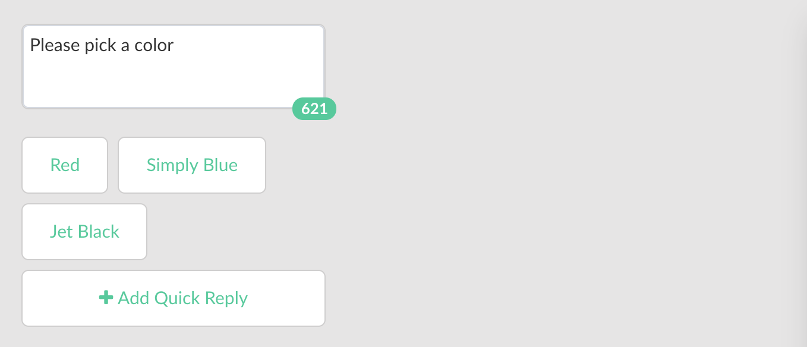

# Building a Bot

## Working with Intents

An Intent contains a group of expressions that define the intention of a user input.
Below is an example of expressions:

* Hi there!
* How's the weather in Paris?
* I want to travel from San Francisco to Madrid

An expression can be grouped into an intent and each intent has responses that will be sent out to the user.
An Intent is context driven which is different from keyword-based systems where it will not recognize an expression or sentence if it is not an exact match.

Here is an example of a context:

Here, I can say "What do you mean by a chatbot?" or "What is a chatbot?" and it will still return the correct intent since the context is same or intead of "Paris", I can ask "How's weather in London?".

_Intents make your bot intelligent!_

An expression can also have entities that can tell the natural language processor (AI) to extract a certain part of the sentence that will let you write custom logic (advanced). 


In short, an Intent is a box full of expression and can have responses that are triggered by an user input or action.

## Defining Entities

You can define an entity by highlighting a word and then clicking on the entities from the list or creating a new one by typing into the filter box.


It is set a user variable and can be accessed using the double braces syntax `{{nlp.location}}` or you can reference it from script block in the following way:

```javascript
exports.handler = (context, done)=>{
    const location = context.nlp.entities.location;
    // check confidence and write custom logic
    done();
};
```

## Creating Responses

You can use plugins or cards to create responses. Responses can be visual or plugins to create flow or trigger other intents. A typical response can combine the following elements to build a rich user expereince for your bot:

*  Text
*  Image
*  Card 
*  Gallery
*  Generic Template (Facebook)
*  Article (WeChat)
*  Audio
*  Video
*  User Input
*  Go to Intent
*  User Variable
*  JSON API

Using plugins, implement custom logic, capture and validate input, make API requests and overall extend your bot for a richer experience


### Go to Intent

The plugin allows you to design conditional conversation flow. This helps you implement complex flow in your bot that is triggered due to a user input or API response.

Here, in the example, the bot will take the user to a confirm transaction flow based on input. First, ask the user what they want to do next:


Next, use `user-input` plugin to capture the input. The following is an example of pattern validation with a regular expression:


Finally, send the user to a `yes-flow` intent based on if the user typed/pressed (`facebook` quick-reply) "yes" in the following way:


Otherwise, continue to no flow:


It is possible to use a second "go to" here in order to take the user to a dedicated __no flow__ intent or send to a default intent to restart the conversation.


### User Variables

User variables can be used to identify user profile (e.g. Facebook) or set by the user to identify a flow to send out broadcast / push notification at a later time. 

As your bot is connected to `Facebook`. It will assign the following variables:

    * first_name
    * last_name
    * gender
    * locale
    * profile_pic
    * timezone


You can access a user variable using the double braces syntax in the following way:


It is also possible to set your own user variables that is available throughout the user context. You can use the user variable plugin to do so as shown below:


In the above example for `claimed`, either you can take the user to a particular flow using the `go-to` plugin:


Or send a broadcast to users who have claimed a coupon.


Here is a list of user varaibles native to each platform:


| Platform | variables | comments|
| -- | -- | -- |
| Facebook | first_name, last_name, profile_pic, gender, locale, timezone | -- |
| WeChat | first_name | `nickname` and set as first_name |
| Viber | first_name, last_name | -- |
| Telegram | first_name, last_name | -- |
| Website | first_name, last_name | Set from the copy script. |


### User Input

The plugin allows you to capture and validate input from a user. It can be simple text or in the form of an action.

It supports the following data types:

* Text
* Number
* Date


In order to validate an input (e.g. email), add the user input plugin in the conversation flow and set `{{email}}` as a variable to store the data after successful validation which will be available in the conversation scope to use.


User input not only works for `text` input but also actions (facebook or website) where I want to filter out results based on some given criteria and at the same time validate the input.




A pattern is a `regular` expression, here I have ensured using the following pattern that it only accepts `blue`, `red` or `black`.


In order to set a user action as input, you have to select "User Input" from the drop-down then set the reply as shown below:


Use the result from the plugin in the following:


This variable is also available inside `code` script and you can get the value in the following way:

```javascript
exports.handler = (context, done) => {
    console.log(context.vars.get("color"));
    done();
};
```

Using action as input parameter makes it intuitive as it drives the user to a correct flow rather I have to figure out via trial and error.


