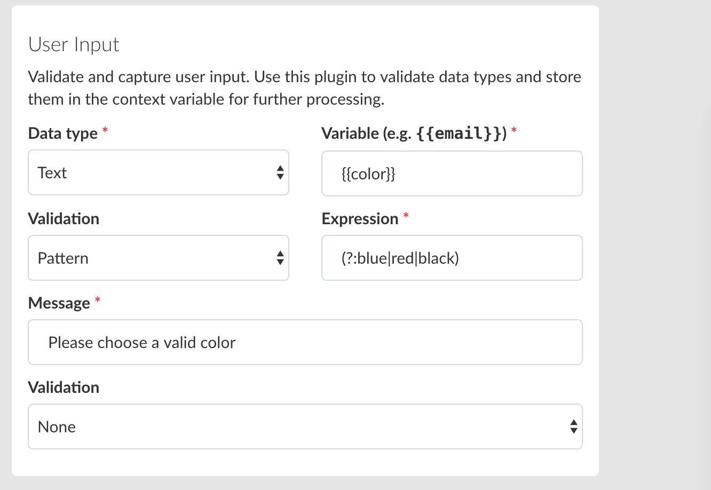

# Capturing User Input

It is possible to capture user input in a bot. You can ask for input in two ways:

* Free-form 
* Reply

The folloiwng types can be used for an input:

* Text
* Number
* Date

It is possible to capture user input and set it as a user variable to use throughout the scope of the session to take the user to various flows.

Here in the example, we are validating an email in the following way:


It is possible to capture input not only  for "text" input but also in form of a reply (e.q, quick replies) as shown below:


Here, in addition, we have used a regular expression pattern to ensure that it only accepts `blue`, `red` or `black`.



In order to capture quick replies as input, you will have to select "User Input" from the context drop-down and then set the reply as shown below:


Captured input is stored as a variable and you can print it inside a text element or use in it a different plugin as an input in the following way:


In a more advanced scenario, you can reference the captured user input from a script block as shown below:

```javascript
exports.handler = (context, done) => {
    console.log(context.vars.get("color"));
    done();
};
```