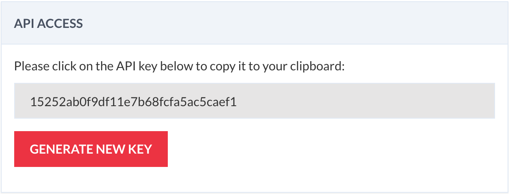
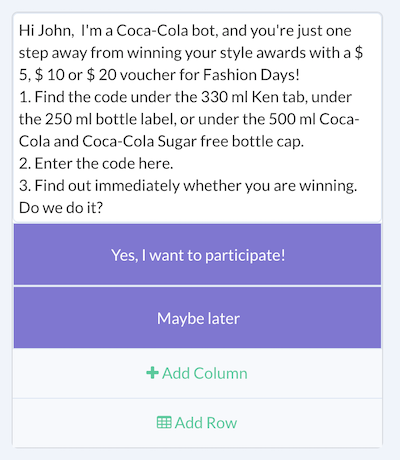
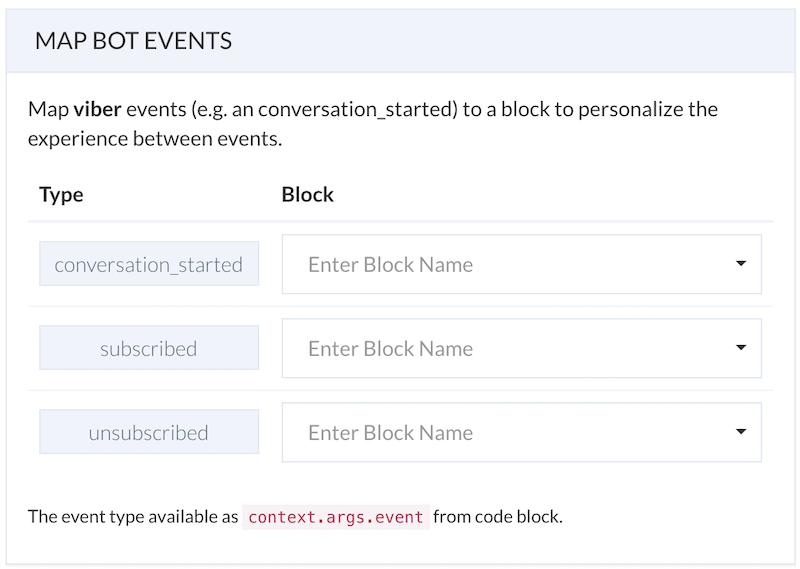

# Channels


## Facebook

### Connect your bot to a page

Connect your bot to a Facebook page using the Connect / Disconnect capability. If you are not already logged in using Facebook, it will take you through a wizard to connect Smartloop app to your page.


### Greeting Text

Greeting text is shown on the welcome screen. You can update the greeting and include {{user_first_name}}, {{user_last_name}} and {{user_full_name}} to make it more personalized.


### Persistent Menu

The persistent menu allows you to have an always-on user interface element inside Messenger conversations. This is an easy way to help people discover and access the core functionality of your Messenger bot at any point in the conversation.

You can link a block to the persistent menu. Click on "+ Menu Item" button to link blocks as shown below:


### Customer Chat Plugin

Facebook customer chat plugin allows you to integrate messenger experience into your website. 

Configure your customer chat plugin from `configure -> Customer Chat` as shown below:


Copy and paste the script to your website before the `<body/>` tag.


### Actions

Suppose that you want to increase your abandon cart revenue. You want to create a campaign that will send a reminder to the user when someone didn't complete the purchase. 

Let's create a block called `purchase` and add the following button:


Create another block to receive the notification (e.g. `attempted-purchase`), click on the share link and copy the block ID as shown below:


Copy and paste the following script before the `<body/>` tag of your webview:

```javascript
<script src="https://scripts.smartloop.ai/v1/fb.actions.js"></script>
<script>
 window.extAsyncInit = function () {
 Smartloop.init('ACCESS_TOKEN');
 Smartloop.executeBlock('BOT_ID', 'BLOCK_ID');
 };
 (function (d, s, id) {
 var js, fjs = d.getElementsByTagName(s)[0];
 if (d.getElementById(id))
 return;
 js = d.createElement(s);
 js.id = id;
 js.src = "//connect.facebook.com/en_US/messenger.Extensions.js";
 fjs.parentNode.insertBefore(js, fjs);
 }(document, 'script', 'Messenger'));
</script>

```
Copy & paste the `ACCESS_TOKEN` from `configure-> api access`.



Copy & paste the `BOT_ID` from the URL as shown below:


Finally, subscribe the user to a campaign to send out a reminder.


Repeat the process by sending the user to a second attempt flow or mark the subscriber as won/lost.

This process makes it super simple to implement messenger marketing flows in your bot, increase abandon cart revenue, or re-target your subscribers that make the most sense for your use case.


## Website

Website bot gives the user a similar experience to that of a live chat. However, the conversation happens with an automated agent instead of a human. It increases efficiency and improves the quality of service.

### Configure and Install

To install the webchat module, please follow the simple steps below:

Click on the configure icon in your dashboard: 


To ensure that it is consistent with your brand, customize the look and feel of the module:


Next, follow the instructions to copy and paste the webchat module to your site:


### Understanding your Website Visitors

Every visitor of your bot gets a unique ID that you can use to track and analyze in various steps of your website flow. 

Below are the `javascript` API methods that can be used to get the user ID and update the profile:

Get the active user ID using `getUserId`

```javascript
const userId = webchat.getUserId()
```

Use `setUser` to collect user information to target and engage at a later time:

```javascript
webchat.setUser({
 first_name: 'Jim',
 last_name: 'Morrison',
 country : 'US',
 phone: '+1(---)----,
 email: 'jim@smartloop.ai'
});
```

`window.webchat` is available throughout the scope of the page after the webchat module is initialized.


### Sending Events to the Bot

Send an event notification to the bot to trigger a flow. 

The following example provides an example of how to set it up after the bot is set up. 

First, create the HTML button object:


```html 
<button id="request-a-demo">Request a Demo</button>
```

Copy and paste the following script before the `<body/>` tag:

```javascript
<script>
 (function(d) {
 d.addEventListener('DOMContentLoaded', function() {
 d.getElementById('request-a-demo').addEventListener('click', function() {
 webchat.open('block-id');
 });
 });
 })(document);
</script>
```

Here, it will open the website bot and take the user to the flow for the given block when the user clicks on **Request a Demo** button.

To configure the script with a block id, Inside the builder, click on the `</>` icon to get started:


### Properties

Below is a table with the definition of properties to configure your web chat module: 

| Configuration | Value|
| -- | -- |
| Theme Color | Theme of the bot. It includes icon, text and bar color |
| Secondary Color | Color of the text bubble. |
| Greetings text | Shown the first time the page loads.
| Greetings delay| Delay in seconds before showing the greetings message. Default = 5 seconds
| Launcher Icon | Start button icon |
| Silent Mode | On/Off. Default = off |


## Viber

### Design Consideration

#### Conversation started Event

When someone messages your bot for the first time or downloads a sticker pack, viber sends out `conversation_started` event. You can only send one message either a simple text or a rich media. Consider `conversation_started` as a welcome block. A good design is to use this block as a segue to engage your subscribers. Give them a way to click on a button (keyboard button) that will start the conversation as users go through the subscription process.




One way to ensure this is to create two different blocks for `conversation_started` and `subscribed` events and apply the design principal, as mentioned above. Map your Viber events as described below to your desired block.

#### Naming Convensions
Make sure your Viber bot name is not too long. Make it short and precise. Viber also has a limitation of 28 characters for a sender name.

### Mapping Bot Events

Navigate to __Settings -> Map Bot Events__ section. Map viber bot events to a block. 




You can map the following events to a block in a **Viber** bot:

| Type | Property | Comments |
| -- | -- | -- |
| conversation_started | event | when a user follows a Viber bot |
| subscribed | event | Triggered when the user sends the first message after `conversation_started` | 
| unsubscribed | event | When a user leaves the bot. Use this to remove user info, data, etc.|
