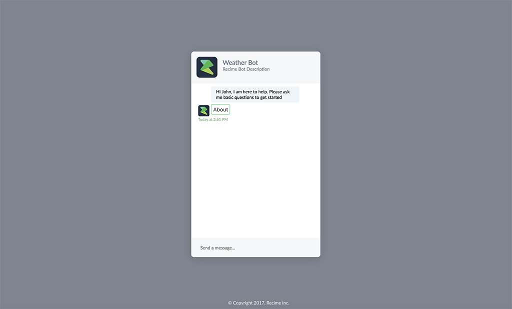

# Command Line Interface

`Recime Command Line Interface` requires [node](https://nodejs.org/en/) (version >=6.9.1) and uses `npm` as package manager.


## Installation

To Install the Command Line Interface, type the following command:

```shell
npm install -g recime
```

Once the CLI is installed correctly, type the following to verify:

```shell
rbp --version
```

## Setting it Up

Go to [console.recime.io/my-account](https://console.recime.io/my-account) and copy the `Access Token`:


Type the following command from your terminal:

```shell
rbp login
```

This will prompt for the token you have copied earlier. Paste and hit "enter". 

## Build

From the terminal app, type the following command to create your bot project:


```bash
rbp create awesome-bot 

```

This will walk you through a command line wizard and create the bot under `awesome-bot` folder.

Navigate to `main.js` and you should see the following:

```javascript
import Ext from 'recime-bot-extension';
import responder from "recime-message-responder";

const __ = Ext.default;

exports.handler = (args, done)=>{
    done(responder.respond(args));
};
```

This will also create a version in [console.recime.io](https://console.recime.io) with basic intents to help build the conversation flow.

## Debugging


In order to debug your bot, type the following command:

```shell
rbp serve
```

The will prepare the bot and star the local server under `http://localhost:4000`.




For any changes you make in the source, it will automatically restart the process and sync the browser.


## Deploy

Bot created using command line interface is in intermidiate state. This gives you a way to set responses locally and write your own logic. In order to push changes to live, you will need to deploy it using the following command:

```shell
rbp deploy
```
This configure and deploy the bot with your local changes and prepare it for pushing to various channels.


