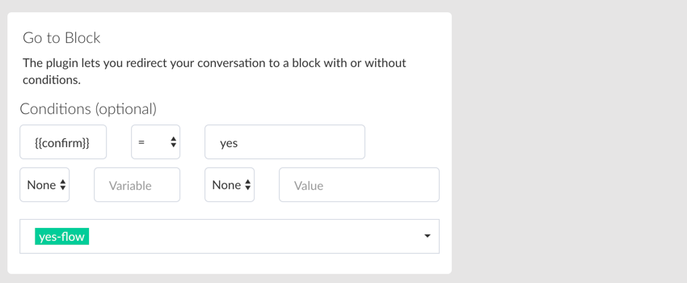

# Core Plugins

Implement custom logic, capture and validate input, make API requests and overall extend your bot for a richer experience.

## Go to Intent

The plugin allows you to design conditional conversation flow. This helps you implement complex flow in your bot that is triggered due to a user input or API response.

Here, in the example, the bot will take the user to a confirm transaction flow based on input. First, ask the user what they want to do next:


Next, use `user-input` plugin to capture the input. The following is an example of pattern validation with a regular expression:


Finally, send the user to a `yes-flow` intent based on if the user typed/pressed (`facebook` quick-reply) "yes" in the following way:




Otherwise, continue to no flow:


It is possible to use a second "go to" here in order to take the user to a dedicated __no flow__ intent or send to a default intent to restart the conversation.


## JSON API

The plugin allows you to create server-side integrations or define your conversation logic based on dynamic content. You can make the following HTTP requests:

* GET
* POST
* PATCH
* DELETE
* PUT

In addition, you can pass query string parameters, POST body, and headers to address a various type of custom implementation. It is possible to use user variables as parameters using the double braces syntax to pass user input and NLP response. Here is an example of how to use JSON API in order to get weather information:


Here, location is defined as an entity from the "Define Expressions" tab:


The response is saved in \{\{result}} varaible which is used from the text element to print out the current weather information in the following way:


JSON API allows you to implement the following use-cases:

1. Retrieve dynamic content.
2. Create server-side integrations, where it will send data to an endpoint whenever a conversation reaches a certain point.
3. Trigger an event.


## User Input

The plugin allows you to capture and validate input from a user. It can be simple text or in the form of an action.

It supports the following data types:

* Text
* Number
* Date


In order to validate an input (e.g. email), add the user input plugin in the conversation flow and set `{{email}}` as a variable to store the data after successful validation which will be available in the conversation scope to use.


User input not only works for `text` input but also actions (facebook or website) where I want to filter out results based on some given criteria and at the same time validate the input.


A pattern is a `regular` expression, here I have ensured using the following pattern that it only accepts `blue`, `red` or `black`.


In order to set a user action as input, you have to select "User Input" from the drop-down then set the reply as shown below:


Use the result from the plugin in the following:


This variable is also available inside `code` script and you can get the value in the following way:

```javascript
exports.handler = (context, done) => {
    console.log(context.vars.get("color"));
    done();
};
```

Using action as input parameter makes it intuitive as it drives the user to a correct flow rather I have to figure out via trial and error.

