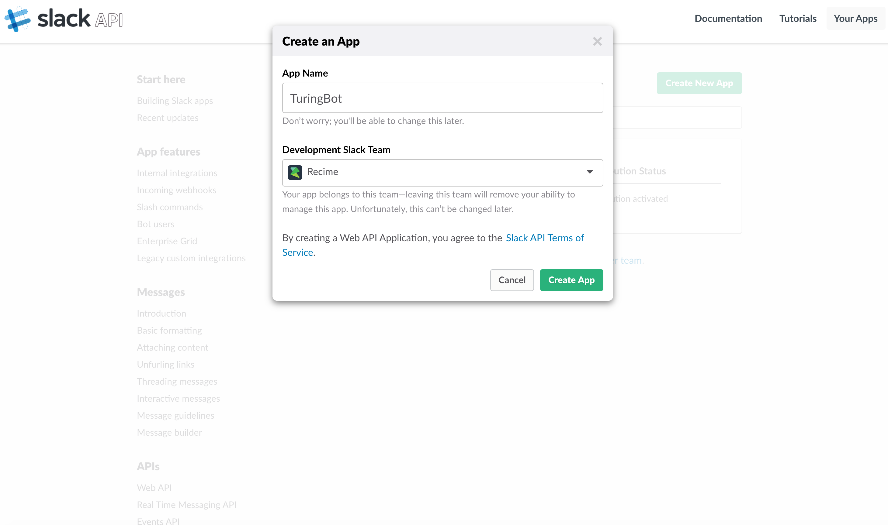
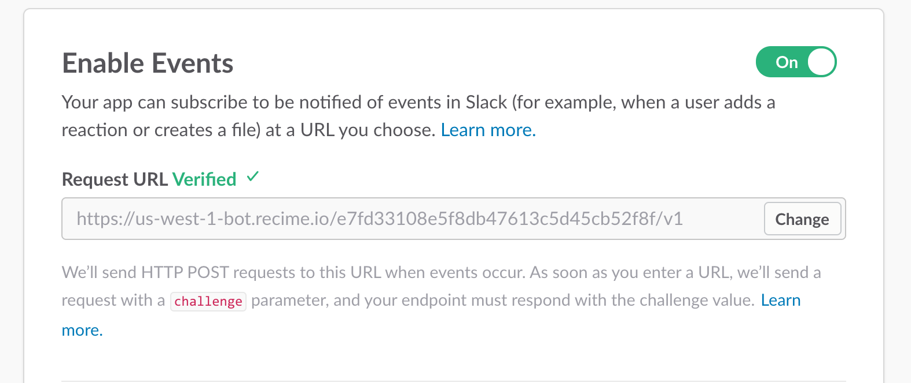
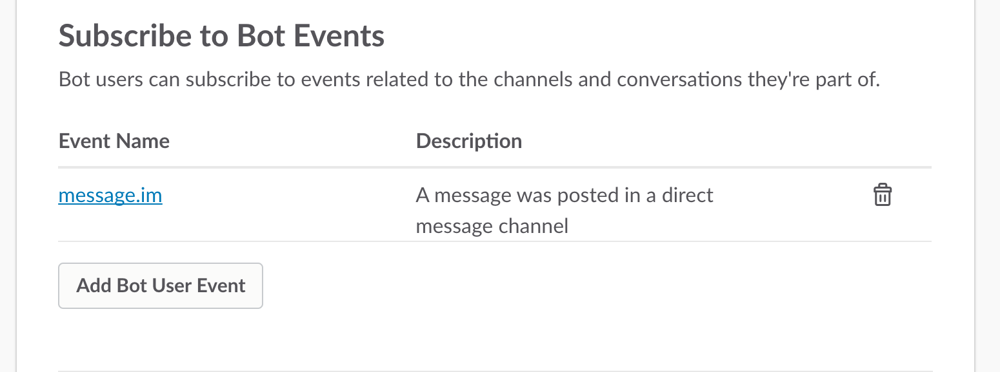
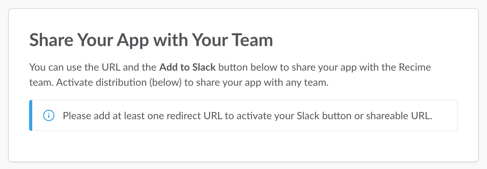
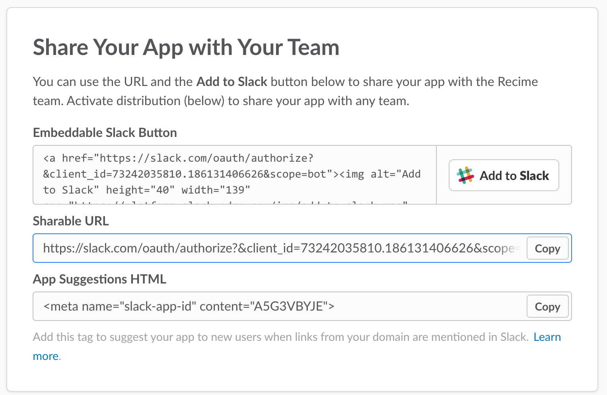
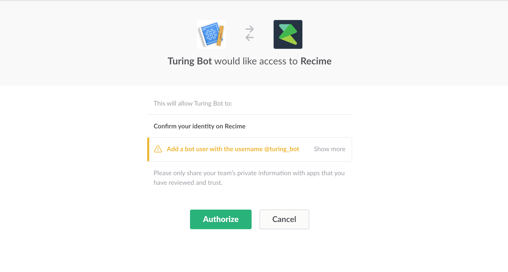
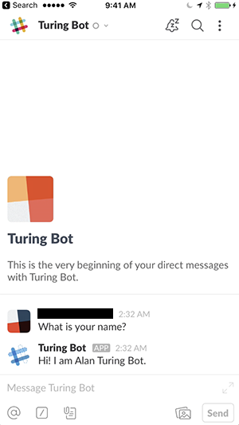

# Build a Slack Bot

Use the Command Line Interface to craete a bot project in the following way:

```shell
rbp create slack-bot
```

Go to your `main.js` file and you will find the following:

```javascript
import Ext from 'recime-bot-extension';
import responder from "recime-message-responder";

const __ = Ext.default;

exports.handler = (args, done)=>{
    done(responder.respond(args));
};
```

This will also create the bot in your dashboard. Use the coversation builder or have addtional logic to handle slack commands `args.command` or totally implement custom flow and then send out response using `recime-bot-extension` npm module.


## Create Slack App

Login to your slack account, go to [apps](https://api.slack.com/apps) page and create a new app.





Specify name of the app and the development team in the "Create an App" dialog as shown above.


## Configure & Deploy

Go to "Basic Information". Take a note of the `Client ID` and `Secret`.


From `rbp` type the folloiwng command:

```
rbp config slack 

```

This will start the interactive prompt for setting `Client ID` and `Secret`. These are used by `Recime` framework to initiate the `OAuth` flow on behalf of the user.


Deploy the bot by typing the following command:

```
rbp deploy

```

## Configure Slack Bot


Once deployed, the first step is to create a bot user. Go to "Add Features" section and click on "Bots" to add a new bot user.


Click "Add Bot".


Next, go to "Basic Information" and click on "Events Subscription" under "Add features and functionality". Toggle the "Enable Events" switch and then paste the bot endpoint in the `Request URL` textbox in the following way:



Next, subscribe to the events relevant to your bot. In this case, I've subscribed to `message.im` event that will send a callback to the bot for direct messages.




At this point, we have successfully configured the slack bot. Next step is to activate distribution for the bot to be shared with teams or submit your app to the [Slack App Directory](https://slack.com/apps).


## Manage Distribution

In order to distribute slack app with teams. First step is to add `redirect URL` to activate slack button or share link.




Under "Share Your App with Other Teams" set `Recime` bot enpoint as `redirect URL`.


 


Click "Save URLs"




This will generate the `Add to Slack` button and `Share URL` both of which will automatically initiate the OAuth flow.



Once successful, it will install the bot for the selected team and show you confirmation dialog like the following:


To distribute the bot publicly in slack apps directory, go to "Share Your App with Other Teams" and check "I’ve reviewed and removed any hard-coded information." under "Remove Hard Coded Information".

Click "Activate Public Distribution".


## Test your Bot

Tap on your bot from the "Direct messages" list and start chatting with it.




## Branding

`Recime` makes it really simple to brand and distrbute slack apps.

It is possible to customize the look and feel of OAuth dialog to match your product. By default it shows the recime branded dialog. In order to override, include a `dialog.html` in your bot project. This is a single page dialog and it is possible to change the look and feel using header or inline css+js or via CDN.

Use the following as a baseline template with bot specific metadata to brand your own:

```html
<html>
    <h1>{{title}}</h1>
    <div>
        
        <div class="team">
            <h3>{{team.name}}</h3>
            <p>{{team.id}}</p>
        </div>
    </div>
</html>
```


