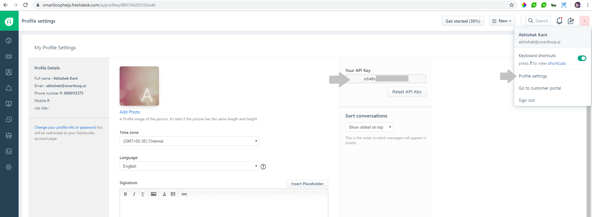
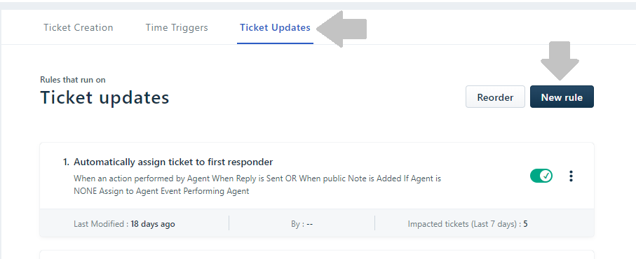

# How to integrate Freshdesk with a Smartloop bot


Smartloop provides a comprehensive integration with Freshdesk. The bot can:
1. Create a new ticket in Freshdesk
    * Attach appropriate files in support of the ticket
2. View the ticket:
    * All tickets created by the user
    * Details of a specific ticket
3. Be notified when the ticket gets updated in Freshdesk
4. Add a comment to the ticket

## Getting Started

First, you'll need to start with our [Freshdesk Template](https://dashboard.smartloop.ai/templates/4d07a090cfb011e980d2bbfc29bc501b)

If you don't have an account on Smartloop yet, you will be asked to create a new account.

A new *Facebook* bot will now be created in your account. We will be working with this bot.

## Connect Freshdesk to your Smartloop bot

To configure settings in the Smartloop bot, click on "Configure" button.


Scroll down and find the **CONFIGURATION** section.

Make sure that the Key `GRAPHQL_URI` exists with value: `https://freshdesk.smartloop.ai/v1/`

If this key doesn't exist, create a new key value pair with the above settings.


::: tip
These values need to remain as is. No change is required in them.
:::

Scroll up a little and find the **THIRD-PARTY INTEGRATION** section.


Click on the "Connect" button in the **Freshdesk** section. This will open up a modal box as shown.


::: tip Note
If you see "Disconnect" in the **Freshdesk** section, it means that the bot is already connected to a Freshdesk account. Click on Disconnect link to unlink it with the **Freshdesk** account.
:::

We need to enter relevant values from [Freshdesk](https://freshdesk.com/) here.

`Domain`: This is the account URL of your Freshdesk home e.g. smartloophelp.freshdesk.com

`API Key`: To get the API key, log into your Freshdesk account. Click on your username and then Profile Settings. The profile page consists the API Key as shown below. Copy and paste this key in *API Key* settings in Smartloop.



Then click on "Continue".

Select the company you want to configure with the bot from drop down available next: 


Click on "Connect".

::: tip
Inside of the Freshdesk modal please make a note of the `Freshdesk Webhook` value that we will use in the next step.
:::

Save the values by clicking on the *Connect* button.


An important value that needs to be copied from this screen is the API key found in the **API Access** section as shown below:


## Configure Freshdesk to send update notifications to Smartloop

Visit your Freshdesk account.

Click on Admin icon in the left sidebar, followed by Automations. On the automations page, switch to Ticket Updates tab as shown below:



Click on the New Rule button, then name your rule "Smartloop Notifications"

In the *When an action performed by* section, make sure that Agent is selected as below:


In the *Involves any of these events*, include settings for responding to any reply and status update as shown:


In *Perform these actions*, add a new Trigger Webhook with Request Type set to POST. In the URL, paste the Freshdesk Webhook you copied in the earlier step.


Please include the following JSON in the custom headers:
```
{
	"x-api-key": "<Smartloop API key>"
}
```
This API key is the one that was copied earlier from the **API Access** section of the Smartloop Configure section.

To conclude, you would need to include the following two attributes in the Content section - Ticket ID and Triggered Event as shown below:


Click on **Preview and save** to save the settings on Freshdesk page. You will now see a summary modal click on **Save and enable**.

You've now connected your Freshdesk account to your Smartloop bot. Finally, [publish this bot to Facebook](./publish.html#facebook)
