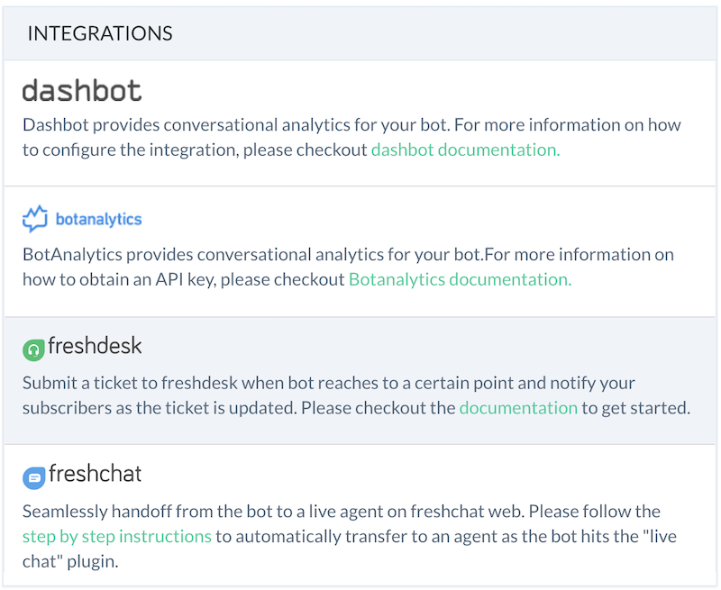
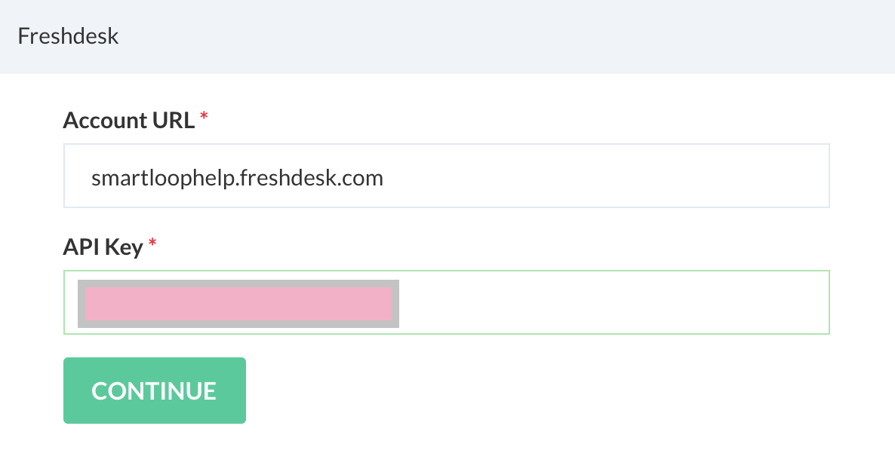
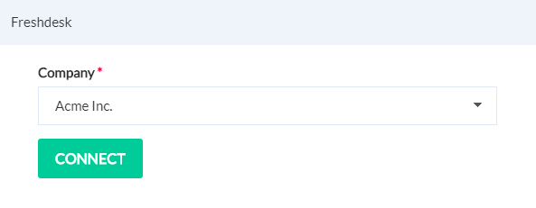
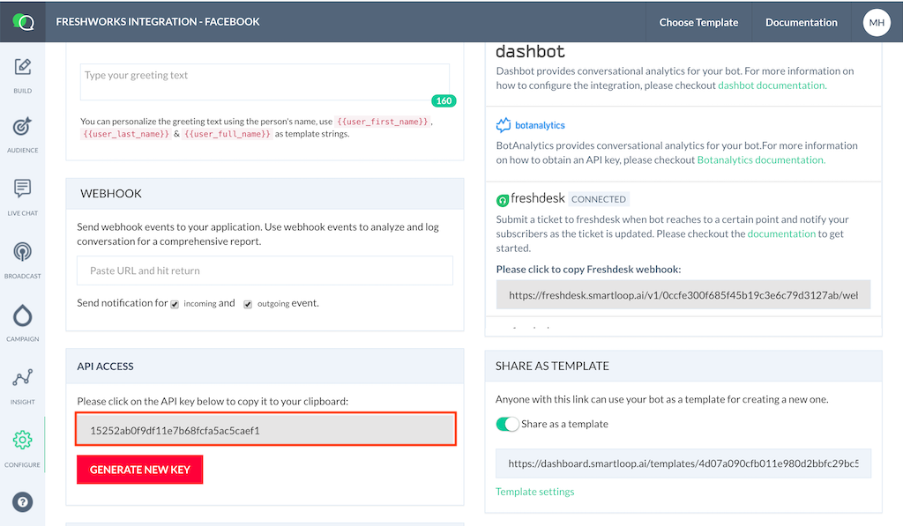
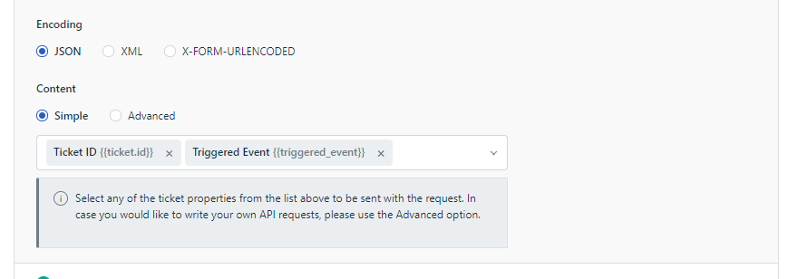

# Integrate Freshdesk with a Smartloop bot

Please follow the simple steps to integrate Freshdesk with a Smartloop bot. 

We will be using a pre-built template to jumpstart a few things, ideally our goal is to do the following:

:::tip Freshdesk Integration

* Create a new ticket in Freshdesk.
* View the ticket details and status:
* Be notified when a ticket is updated in Freshdesk
* Add comments to the ticket directly from a messenger bot.
* Upload attachments.

:::

## Getting Started

First, you'll need the [Freshdesk Template](https://templates.smartloop.ai/v1/4d07a090cfb011e980d2bbfc29bc501b). Follow the instructions to install it in your account. We will be using it as a starting point to integrate a messenger bot with Freshdesk.

## Connect Freshdesk to your Smartloop bot

To configure settings in the Smartloop bot, click on "Configure" button.


Scroll down to the **CONFIGURATION** section.

You will find an entry with `GRAPHQL_URI` with value `https://freshdesk.smartloop.ai/v1/`, this is used to send notifications to your bot as the a ticket is updated in Freshdesk


::: warning 
Please don't remove or alter this value.
:::

Click on the Freshdesk link under **Configure -> Integrations** section as shown below.



This will bring up a step-by-step wizard configure the integration:



::: tip Note
If you see "Disconnect" in the **Freshdesk** section, it means that the bot is already connected to a Freshdesk account. Click on Disconnect link to unlink it with the **Freshdesk** account.
:::

We need to enter relevant values from [Freshdesk](https://freshdesk.com/) here.

`Account URL`: This is the URL of your Freshdesk home e.g. **https://smartloophelp.freshdesk.com**

`API Key`: To get the API key, log into your Freshdesk account. Click on your username and then Profile Settings. The profile page consists the API Key as shown below. Copy and paste this key in *API Key* settings in Smartloop.


Then click on "Continue".

Select the company you want to configure with the bot from drop down available next: 



Click on "Connect".

Take a note of the `Freshdesk Webhook` that will use in the next step.


Next, copy the API key found in the **API Access** section as shown below to your clipboard and store it in a safe location, you will need it later:



## Configure Freshdesk to send update notifications to Smartloop

Visit your Freshdesk account.

Click on Admin icon in the left sidebar, followed by Automations. On the automations page, switch to Ticket Updates tab as shown below:


Click on the New Rule button, then name your rule "Smartloop Notifications"

In the *When an action performed by* section, make sure that **Agent** radio button is selected as shown below:


In the *Involves any of these events*, include settings for responding to any reply and status update as shown:


In *Perform these actions*, add a new Trigger Webhook with Request Type set to POST. In the URL, paste the Freshdesk Webhook you copied in the earlier step.


Please include the following JSON in the custom headers:
```
{
	"x-api-key": "<Smartloop API key>"
}
```
This API key is the one that was copied earlier from the **API Access** section of the Smartloop Configure section.

To conclude, you would need to include the following two attributes in the Content section - Ticket ID and Triggered Event as shown below:



Click on **Preview and save** to save the settings on Freshdesk page. You will now see a summary modal click on **Save and enable**.

You've now successfully connected your Freshdesk account to your Smartloop bot. Finally, [publish this bot to Facebook](./publish.html#facebook)
