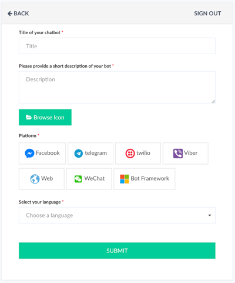
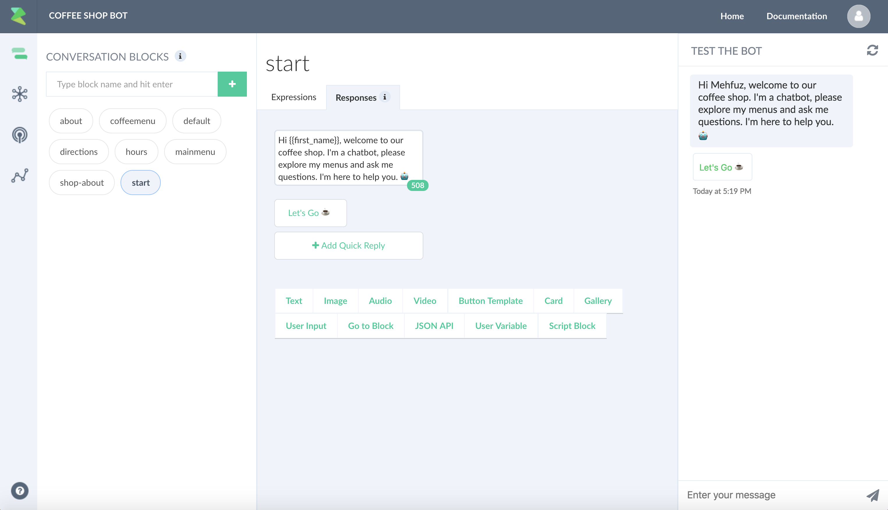
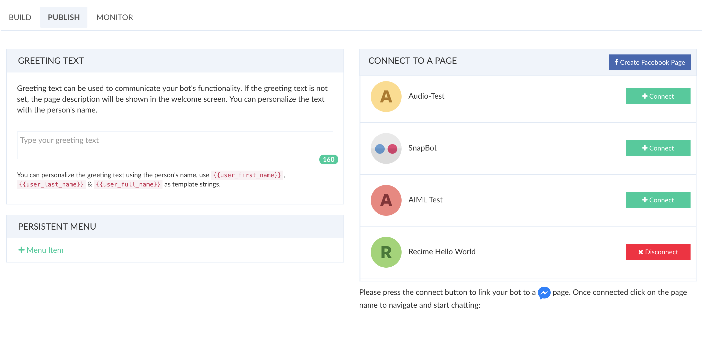

# Getting Started

Once the account is created. Next step is to create your first bot. 

Once you are in your dashboard, press the "+ Create a bot" button. This will give you the create bot dialog:

Enter title, description of the of the bot. Upload an icon (256x256) and finally choose your language. 

Press "Submit".

This will create a blank bot with `start`, `default` and `about` intent. 

Intents are the building blocks of your bot. An intent contains expressions and responses. You can also trigger an intent by a user event (e.g.button click) or by typing the expression or keyword that you have defined in the "Expressions" tab.

Here is the definition of the basic intents that are the building blocks of your bot.

| Intent Name | Description | Required |
| - | --- | - |
| start | Defines the start of the conversation. It is called automatically when the conversation starts | Y |
| about | it is triggered when some types "about" or by a user event.  This contains the default branding information.  | N |
| default | Contains default message shown to a user when the bot does not understand an expression. This is useful for creating an email or support flow | Y |

Go to the "Responses" tab, make some changes and click on the "Test the Bot" button.

Go to Publish tab to connect the bot to your Facebook page, [Viber](https://partners.viber.com/account/create-bot-account) or [WeChat](https://mp.weixin.qq.com/) public account, Telegram using [BotFater](https://telegram.me/botfather) app, copy the script to your website.

