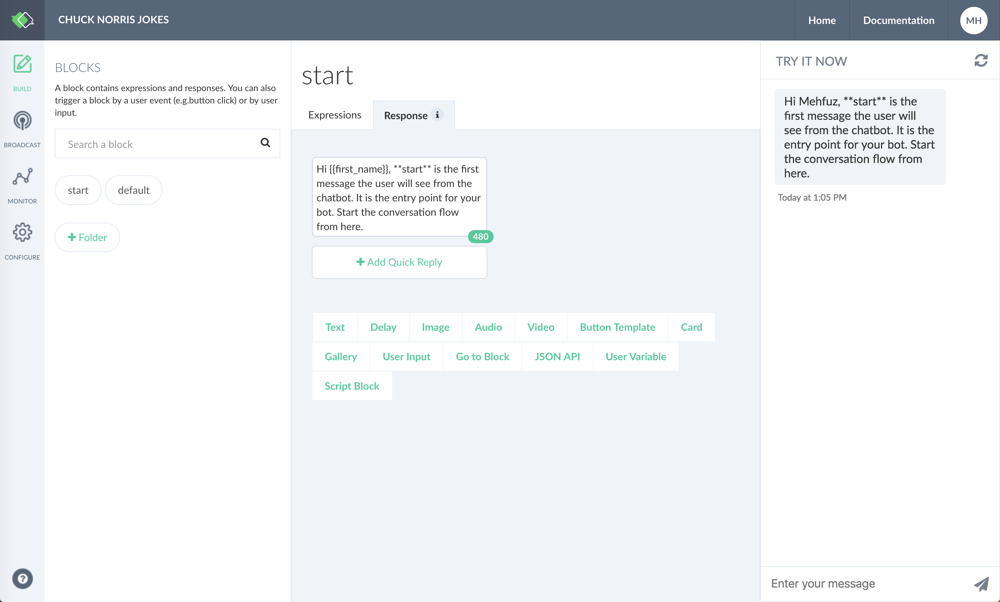
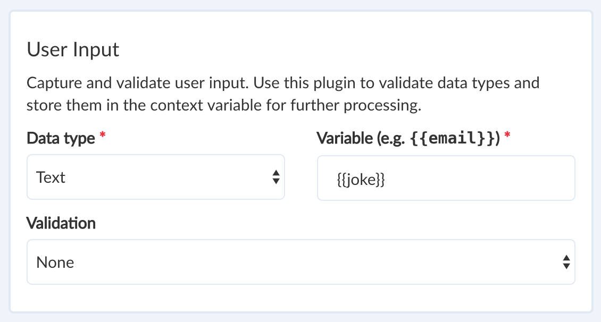
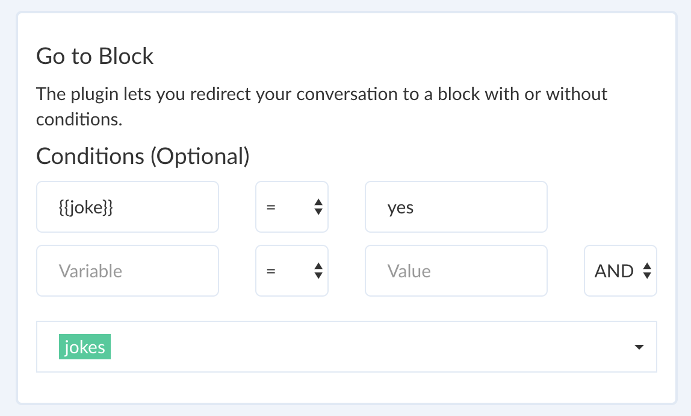
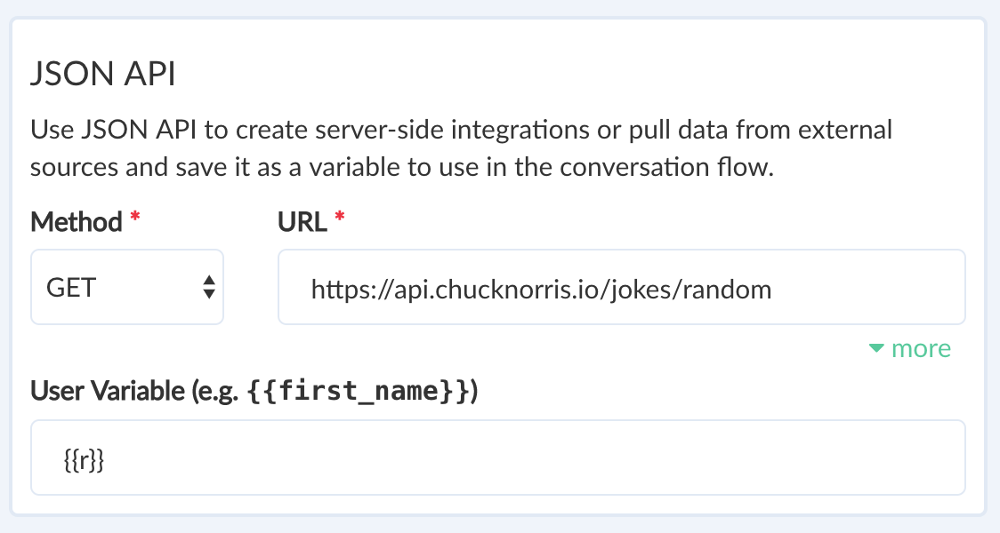
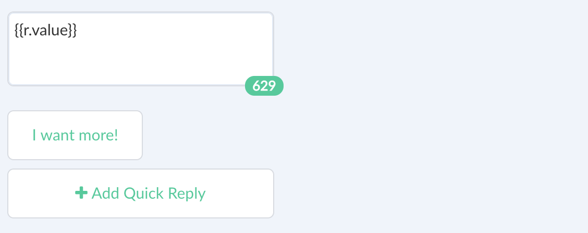
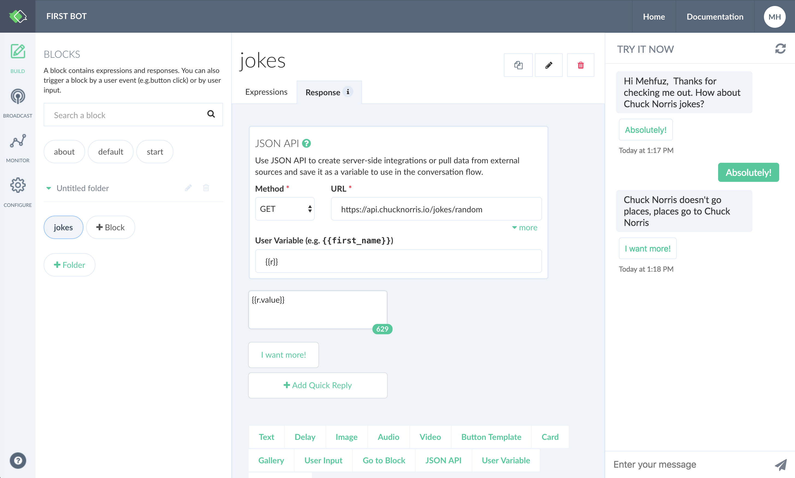
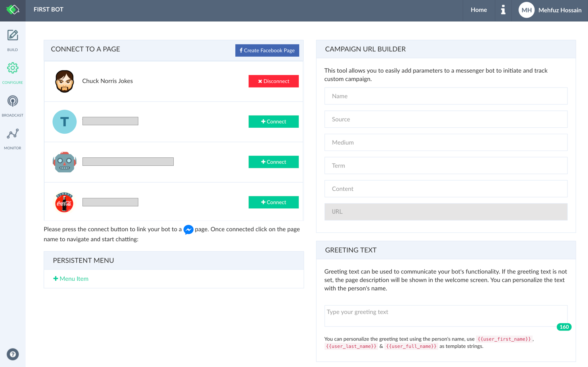
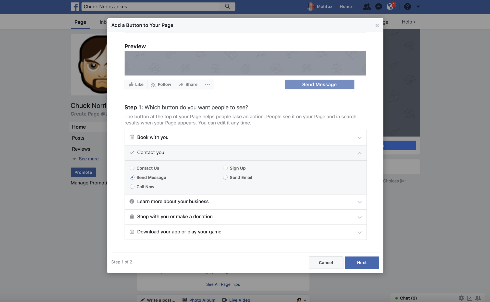
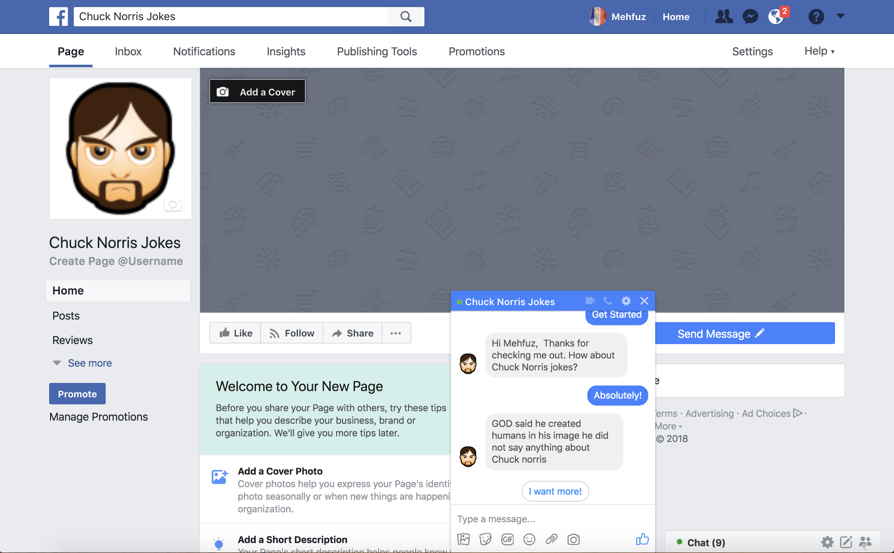

# Getting Started

In this tutorial, we will create and publish a _Chuck Norris_ Facebook bot. The first step is to create a [free account](https://console.recime.io). You can use [github](https://github.com/),  [Facebook](https://www.facebook.com/) or email to get started.

Once you are inside the dashboard, press the "+ Create a bot" thumbnail:

This will bring up the dialog to create the bot as shown below:

Enter the bot title, select a platform. In this case, “Facebook”.  

Click “Submit”.

::: tip What is a block?
A block contains expressions and responses. You can also trigger a block by a user event (e.g.button click) or by user input 
:::

This will create the bot and take you to the builder once completed.

Once, you are inside the builder, the next step is to build a flow. First, customize the greetings message followed by a quick reply in the following way:

We are going to create a flow to take the user to different flows based on user input. To do so first capture the user input using the [JSON](developer-features.html#json-api) plugin:

Next, send the user to a specific block using the [Go to Block](building-a-bot.html#creating-responses) plugin. Create an empty block “jokes” and send the user to it based on the user input as shown below:

Inside "jokes", add a JSON Plugin to pull random jokes and store it in a user variable in the following way:

Print the joke using a text block in the following way:

Go to the "start" block and add an alternate flow with information on driving your user to the main loop:

That's it, you have created your first "Chuck Norris" bot.

 

Go to _publish_ tab by clicking the configure icon from the navigation bar and connect to your page by clicking on the “+ Connect” button. If you are not signed in  with Facebook, it will take you through  the authentication process:

Now that you have successfully published the bot. Go to your page, click on the “+ Add a Button” and select "Contact us/ Send a Message". In the next step, as where to send the users, choose “Facebook Messenger” to respond.

Once the button has been added, hover over it and select “Test Button”. this will bring up the bot and click on “Get started” to chat with the bot.

If you have completed the step then you are have successfully created and published your first Facebook bot. 

Next,  check out [Building a Bot](building-a-bot.html) section for a deep dive on blocks and various chatbot concepts. 

