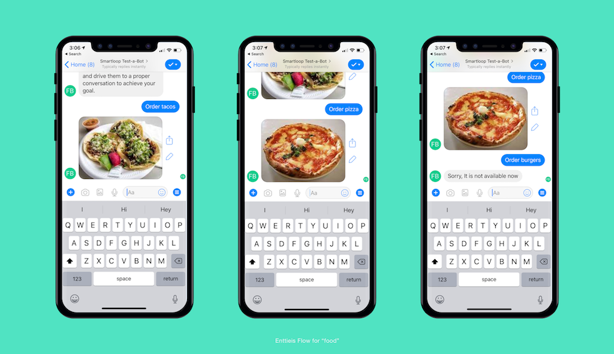
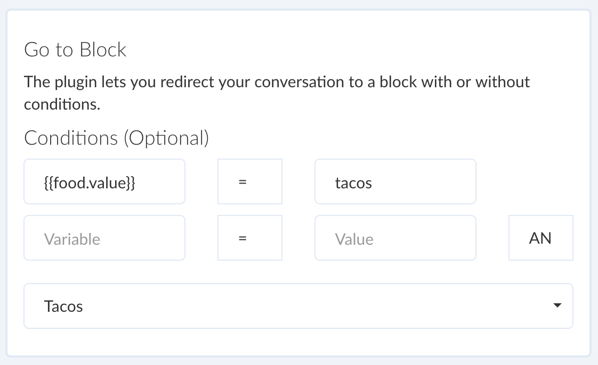

# How to use Entities

Entities help extract word(s) from an expression, group and label them to classify and define a context.



Double tap a word in an expression to associate an entity with it.


It is possible to link the same entity for different words. Like in the above example, we have associated "food" for "tacos" and "guacamole".

Entities defined in this way can be used as a user variable in a block like based on selection, it is possible to send a user to a different block using a 'go-to' based on an entity value.

:::tip
Use the demo template to see it in action:
[https://templates.smartloop.ai/v1/b3221d7de73547f085e3a81416db6c91](https://templates.smartloop.ai/v1/b3221d7de73547f085e3a81416db6c91)
:::



An entity object can have various properties. A system entity or ***Star*** entity can have additional properties. For example, "datetime" can have properties to identify a weekend vs weekday or time of the day when someone says:

> "How's the weather tomorrow?"

Here "tomorrow" will return an additional date object to further understand the intent of the user. 

In general, an entity can have at least the following properties but not limited to:


| Property | Value |
| -- | -- |
| value | The word returned by the entity extractor for an expression. |
| confidence | The confidence level sent by the entity extractor |
| start | start index of the highlighted entity in an expression.|
| end | end index of the highlighted entity in an expression.

## Using entities in a code block


In the above example, we have defined a custom entity `food` to extract a specific word from an utterance. Often, there are cases where we want to wrap that around a custom logic:

Inside a code block, we can reference an entity using `context.nlp.entities.` Below is an example, how to process entities using code block:

```javascript
import Ext from 'bot-extension';
const __ = Ext.default;

exports.handler = (context, done) => {
    
    // console.log(context.nlp.entities[0].entity);
    
    if (context.nlp.entities[0].value === 'guacamole'){
        done(__.text("TODO:// logic"))
    }
    
    done();
};
```