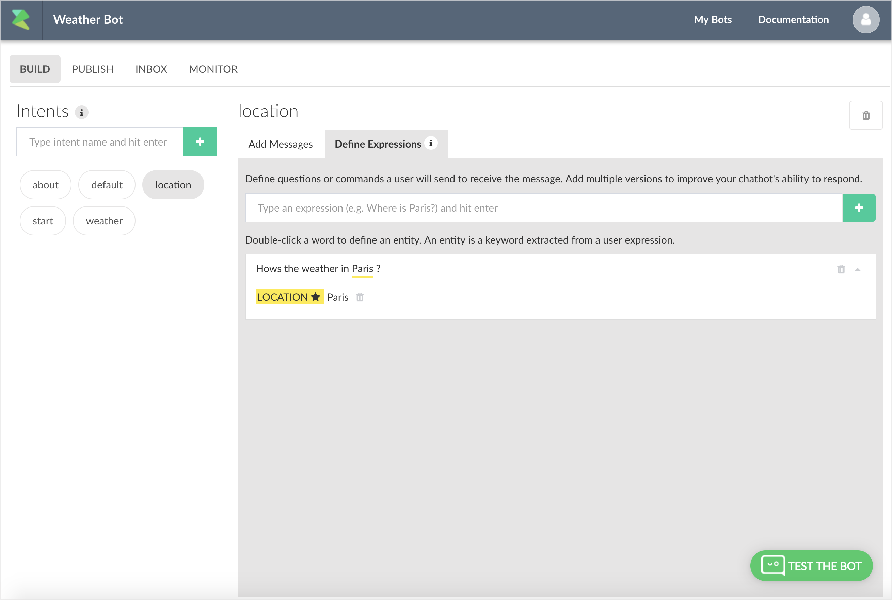

# JSON API

The plugin allows you to create server-side integrations or define your conversation logic based on dynamic content. You can make the following HTTP requests:

* GET
* POST
* PATCH
* DELETE
* PUT

In addition, you can pass query string parameters, POST body, and headers to address a various type of custom implementation. It is possible to use context variables as parameters using the double braces syntax to pass user input and NLP response. Here is an example of how to use JSON API in order to get weather information:

Here, location is defined as an entity from the "Define Expressions" tab:

The response is saved in \{\{result}} varaible which is used from the text element to print out the current weather information in the following way:

JSON API allows you to implement the following use-cases:

1. Retrieve dynamic content.
2. Create server-side integrations, where it will send data to an endpoint whenever a conversation reaches a certain point.
3. Trigger an event.

