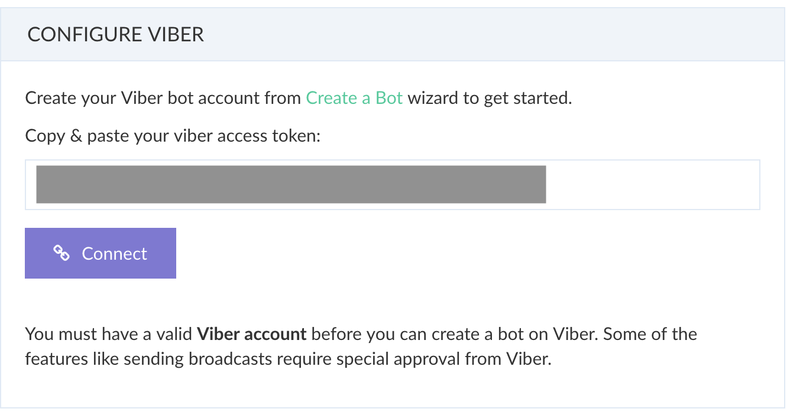

# Publishing a Bot

Different channels have different capabilities and publishing a bot to each one of them is native to the specific platform.


Below is a table showing different types of response supported by each channel:

| Channel | Text | Image | Card | Carousel | Buttons | Quick Replies |
| -- | -- | -- | -- | -- | -- | -- |
| Facebook | Y | Y | Y | Generic Template | Y | Y |
| Website | Y | Y | Y | Y | Y | Y |
| Viber | Y | Y | Y | Y | Keyboard Button | -- |
| Direct Line | Y | Y | Y | Y | Y | Hero Card with Buttons |

## Facebook

### Connecting to a Page 

Connect your bot to a Facebook page using the Connect / Disconnect capability. If you are not already logged in using Facebook, it will take you through the OAuth flow for the required permissions.


### Greeting Text

Greeting text is shown on the welcome screen. You can update the greeting and include {{user_first_name}}, {{user_last_name}} and {{user_full_name}} to make it more personalized.


### Persistent Menu

The persistent menu allows you to have an always-on user interface element inside Messenger conversations. This is an easy way to help people discover and access the core functionality of your Messenger bot at any point in the conversation.

You can link a block to the persistent menu. Click on "+ Menu Item" button to link blocks as shown below:


## Website

Website bot gives user a similar experience to that of a live chat. However, the conversation happens with an automated agent instead of a human. This helps minimize the cost while being very effective and over time can bring in more leads to your website and improve the quality of service.

Click on the publish icon to configure the look and feel of your bot as shown below:


Follow the instructions to copy and paste the web chat module to your site:


### Customization

You can customize the look and feel by modifying the following properties:

| Configuration | Value|
| -- | -- |
| Theme Color | This is the overall theme of your bot. This includes icon, text and bar color |
| Secondary Color | This is the color of the text bubble. |
| Greeting text | This is shown first time bot is loaded.
| Greeting delay| Delay in seconds before the greeting is shown. Default is 5 seconds.
| Launcher Icon | This specifies the icon that is shown in the start button |
| Slient Mode | On/Off. Default "off" |

### Sending Notification to the Bot (Advanced)

It is possible to send a notification to the bot for a user action  that can initiate the bot and take the user to a specific flow:

Let's say you have a `demo` block in your bot and on the website if someone clicks on "Request a Demo" button, it will trigger the demo flow:

```html 
<button id="request-a-demo">Requst a Demo</button>
```

In addition to the script above, copy and paste the following script before the `<body/>` tag:

```javascript
<script>
  (function(d) {
    d.addEventListener('DOMContentLoaded', function() {
      d.getElementById('request-a-demo').addEventListener('click', function() {
        webchat.open('block-id');
      });
    });
  })(document);
</script>
```

This will open the website bot and take the user direct to the specified block when a user clicks on "Request a Demo" button.


## Viber 

If you do not have a public account create a [Viber Public Account](https://www.viber.com/business/#public-accounts). Public account is subject to approval. It is possible to create a [bot account](https://partners.viber.com/account/create-bot-account). Once you have either bot / public account token. Click on the publish icon, copy and paste the token from viber admin portal to the access token field:



Press "Connect" to link your bot with viber.