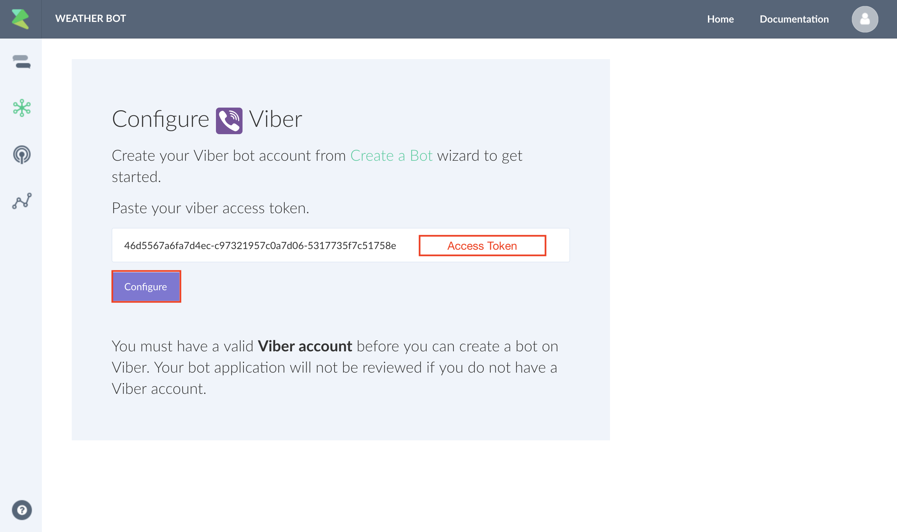
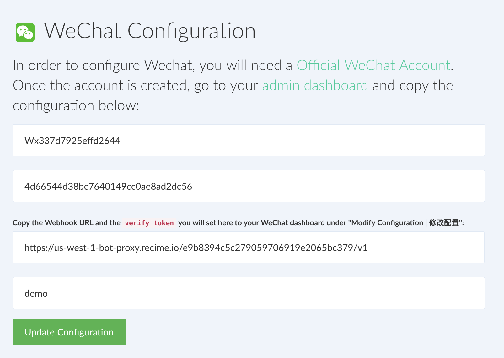
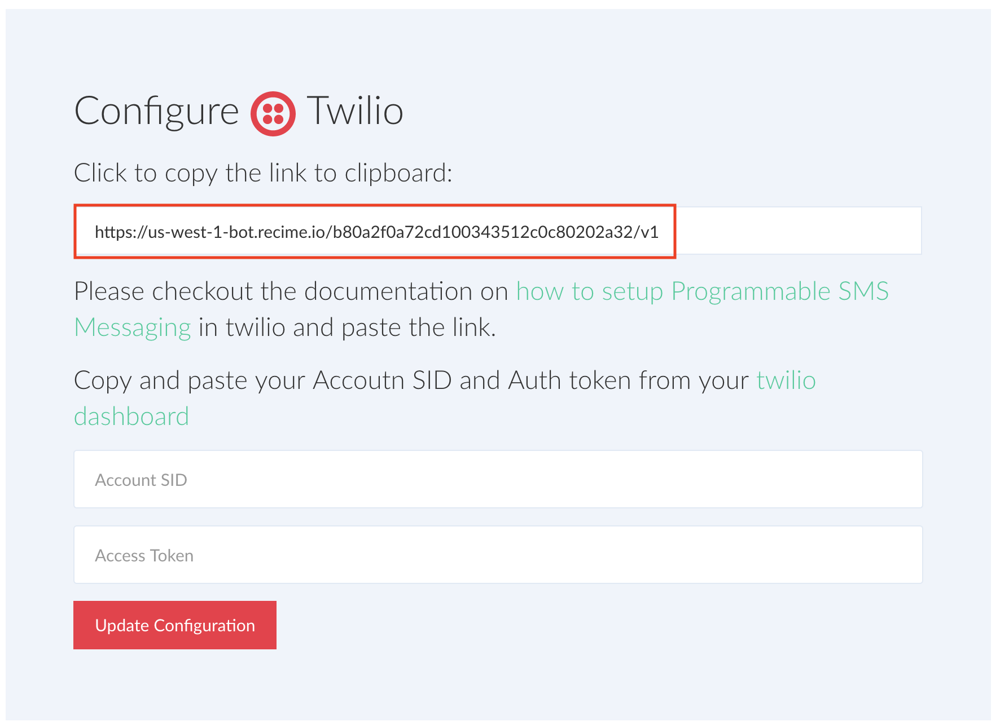
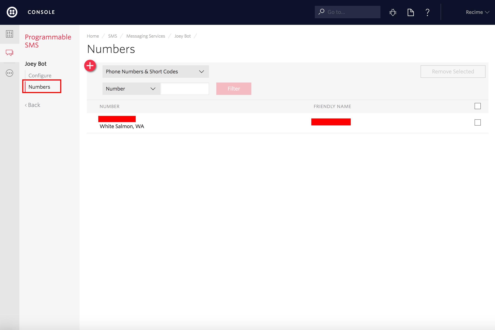

# Publishing a Bot

Different channels have different capabilities and publishing a bot to each one of them is native to the specific platform.

Below is a table showing differnt types of repsonse supported by each platform:

| Platform | Text | Image | Card | Carousel | Buttons | Quick Replies |
| -- | -- | -- | -- | -- | -- | -- |
| Facebook | Y | Y | Y | Generic Template | Y | Y |
| Website | Y | Y | Y | Y | Y | Y |
| Viber | Y | Y | Y | Y | Keyboard Button | -- |
| Telergram |  Y | Y | -- | -- | Y | Y |
| WeChat | Y | Y | -- | Article | -- | -- |
| Twilio | Y | -- | -- | -- | -- | -- |

If you are using `Microsoft Bot Framwork` and Skype, it is translated in the following way:

| Platform | Text | Image | Card | Carousel | Buttons | Quick Replies |
| -- | -- | -- | -- | -- | -- | -- |
| Skype | Y | Y | Y | Y | Y | Hero Card with Buttons |

## Facebook

### Connect / Disconnect 

Connect your bot to a Facebook page using the Connect / Disconnect capability. If you are not already logged in using Facebook, it will take you through the OAuth flow for the required permissions.

### Update Greeting Text on Welcome Screen

Greeting text is shown on the welcome screen. You can update the gretting and include {{user_first_name}}, {{user_last_name}} and {{user_full_name}} to make it more personalized.

### Configure Persistent Menu

The persistent menu allows you to have an always-on user interface element inside Messenger conversations. This is an easy way to help people discover and access the core functionality of your Messenger bot at any point in the conversation.

You can link a block to the persistent menu using by clicking on "+ Menu Item" as shown below:

### Campaign URL Builder

You can easily use campaign parameters in `https://m.me` link and trigger a specific block. The following table gives an overview of various campaign parameters that you take advantage of.

| Type | Description |
| -- | -- |
| Campaign Name ``utm_campaign`` | ``Required`` Use utm_campaign to identify a specific promotion.|
| Campaign Source ``utm_source`` | Use utm_source to identify the link source. Example: facebook|
| Campaign Medium ``utm_medium`` | Use utm_medium to identify a medium such as ``feed``.|
| Campaign Term ``utm_term`` | Use utm_term to trigger a block. Example: start|
| Campaign Content ``utm_content`` | Used for A/B testing and content-targeted ads. Use utm_content to differentiate links.|

Use the campaign link builder form to generate a ``m.me`` link as shown below:

## Website
Website bot helps you replace your live agent with an automated agent. Website bot gives you similar chat window that you generally see when visiting a website but conversation happens with an intelligent agent instead of a human. This can minimize the cost while being very effective and over time can bring in more leads to your website.

Click on the publish icon, copy and paste the script before the `<body/>` tag.

You can customize the look and feel as well as the profile by modifying the following properties:

| Name | Value|
| -- | -- |
| title | Title of your website bot that is shown in the nav bar |
| primaryColor | Theme color of the website bot. |
| meta| User data, in case of logged in user this can be set to track the user|

## Viber 

If you do not have a public account create a [Viber Public Account](https://www.viber.com/business/#public-accounts). Public account is subject to approval. It is possible to create a [bot account](https://partners.viber.com/account/create-bot-account). Once you have either bot / public account token. Click on the publish icon, copy and paste the token

Press "Configure" to set up the webhook.

## Telegram

Use the [Bot Father](https://telegram.me/botfather) app to configure your telegram bot. Once you have created the bot, it will give you an access token as shown below:

Click on the publish icon, copy and paste the token. 

Press "Configure" to set up the webhook.

## WeChat

WeChat is the #1 messaging service in China. It is used by over 700 million users and it is the most important channel in the Chinese market. 

In order to configure WeChat, you will need an [official account](http://open.wechat.com/cgi-bin/newreadtemplate?t=overseas_open/section_detail&show=office). You can also get a [Sandbox](https://mp.weixin.qq.com/debug/cgi-bin/sandbox?t=sandbox/login) to test your bot.

Once your WeChat account is verified, do the following to connect to your bot:

* Go to [WeChat dashboard](https://mp.weixin.qq.com/) and under "Basic Configuration | 基本配置", copy the IP `52.79.59.62` to the whitelist section.
* Go to "console->bot->publish", paste the App ID and App Secret from WeChat dashboard and create a token that you will use to verify the integration.

* Press "Update Configuration".

* In the WeChat dashboard, click on "Modify Configuration | 修改配置" and under "Basic Configuration", paste the Webhook URL from publish page.

* Save the configuration and enable the integration.

## Twilio

### Create a Messaging Service

The first step is to create a new `Programmable SMS Messaging` Service.  Go to Home->Dashboard in your Twilio console.

Select Programmable SMS under the Messaging section:

Next, create a messaging service by clicking on the "Create a new Messaging Service" button:

### Configure Webhook

Once the service is created. Copy the webhook link  from the publish dialog :

Paste it in the inbound request URL textbox :

Save the messaging service by clicking the Save button at the bottom of the screen. Now, add a phone number for the newly added service by clicking on the "Numbers" link in the menu:

If you already have a number you'd like to use, choose that, otherwise create a new one.

Once you got the number and linked it to the messaging service, copy and paste your Account SID and Auth token from your [twilio dashboard](https://www.twilio.com/console):

Click "Update Configuration".
