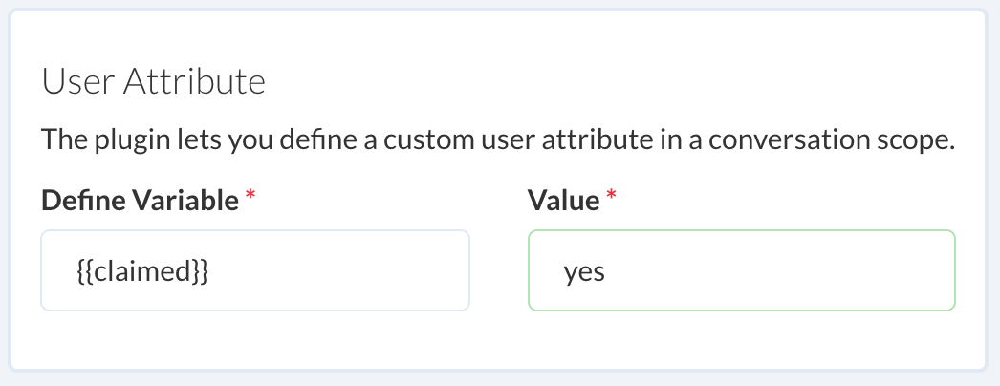
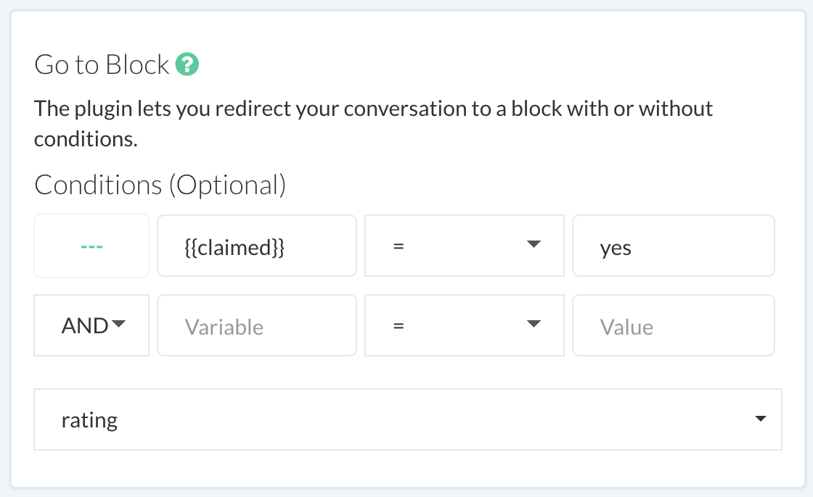

# User Attributes

Use attributes is used to store conversation state and identify a user. You can access an attribute using the **double braces** syntax in the following way:

Here is a list of default attributes names accessible from within the conversation scope by channel:

| Platform | Attribute name | comments|
| -- | -- | -- |
| Facebook | first_name, last_name, profile_pic, gender, locale, timezone | -- |
| Viber | first_name, last_name, language, country | -- |
| Telegram | first_name, last_name | -- |
| Website | first_name, last_name, email, phone | These are a placeholder for website bot and updated automatically when a value is set or updated using `website.setUser` |

::: tip  How to obtain a user Id?
 Obtain a user Id, using the  **double braces** syntax as `user_id`. User id for a channel is unique and can be used to track or send a message using `chat-api`
:::

It is also possible to define your own custom attributes using `User Attribute` plugin. 

Use variables to trigger a conditional flow as shown below:

Or as a filter criteria to send a broadcast (a.k.a. push notifications) to a specific group of subscribers:

