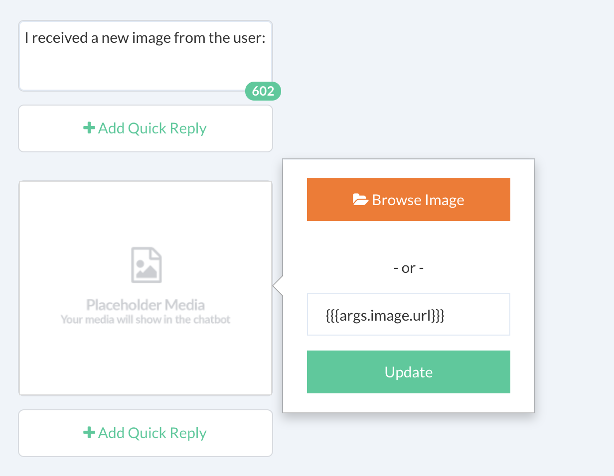

# Handling Input Events

::: warning Facebook only

Input events are currently only supported for messenger bots.

:::

It is also possible to link an input event (e.g. an image) to a block. This is channel specific capability which means each channel have its own set of events that can be captured and mapped to a block.

Navigate to `Settings -> Events map` section.  Map an event to an existing block by selecting from the list as shown below:


Events type is available in the block as an argument and can be accessed as: `args.eventType.propertyName`

Below is a list of common properties for an event type:

| Type | Property | Comments |
| -- | -- | -- |
| image | url | url of the image |
| file | url | url of the file | 
| location | lat, long | latitude and longitude of the location|

For example, if a subscriber sends an image on a facebook bot, it can set as an image place holder in the following way:




::: tip 

A [mustache](http://mustache.github.io/) template is a string that contains any number of mustache tags. Smartloop adopts this most popular template format to process variables. Tags are indicated by the double mustaches that surround them. Here, in the above example triple parenthesis tells the compiler not to encode the url.

:::

Event types can be combined with `JSON API`, `go-to` or `script` blocks to perform various operations from verifying document to serve location-aware contents to your subscribers.


```javascript 
//script block
exports.handler = (context, done) => {
    console.log(context.args.image.url);
    done();
};
```