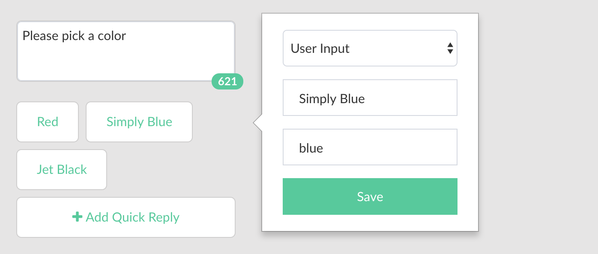

# User Input

User Input plugin allows you to capture and validate input from a user. It can be simple text or in the form of action.

It supports the following data types:

* Text
* Number
* Date

In order to validate an input (e.g. email), add the user input plugin in the conversation flow and set `{{email}}` as a variable to store the data after successful validation which will be available in the conversation scope to use.

User input not only works for `text` input but also actions (facebook or website) where I want to filter out results based on some given criteria and at the same time validate the input.

A pattern is a `regular` expression, here I have ensured using the following pattern that it only accepts `blue`, `red` or `black`.

In order to set a user action as input, you have to select "User Input" from the drop-down then set the reply as shown below:

Finally, I've used the result from the user input as a variable in the following way:

Using action as input parameter makes it much faster and intuitive as it gives the user clue on what to reply rather via validation error in a certain use-case.